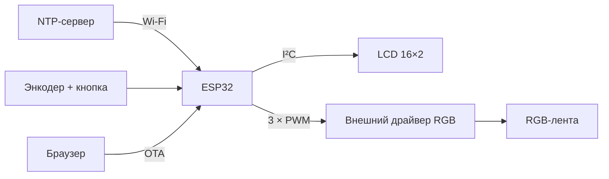

**Владислав Чернухин** · [Инженерное портфолио](https://github.com/TzarRusi)

Световой будильник на ESP32: плавно меняет цвет и яркость RGB-ленты, отображает время на LCD и позволяет управлять режимами энкодером. Проект развивает идею [часов-рассвета AlexGyver](https://github.com/AlexGyver/dawn-clock) для ESP32 с сетевой синхронизацией времени и веб-обновлением прошивки.

## Результат

**Устройство собрано и проверено на аппаратуре. Все аппаратные узлы работали; я пользовался будильником не менее года.**

## Возможности

- Плавный рассвет с настраиваемыми длительностью и яркостью.
- LCD 16×2 по I²C: время, дата, день недели и время будильника.
- Синхронизация времени по **NTP** через Wi-Fi; смещение UTC+3 задано в коде.
- Энкодер с кнопкой: управление настройками и режимом ночного света.
- Обновление прошивки через веб-интерфейс.
- Расписание по дням недели; заготовки условия чётности недели сохранены в комментариях. В текущей ревизии все дни установлены на 09:30.

## Подключение по исходнику

| Сигнал | GPIO / настройка |
|---|---|
| RGB: R / G / B | 19 / 18 / 5 |
| Энкодер: CLK / DT / SW | 25 / 33 / 32 |
| Подсветка LCD | 13 |
| Индикатор | 2 |
| LCD | I²C, адрес `0x27`, 16×2; пины Wire по умолчанию выбранной платы |
| PWM | 10 кГц, 8 бит |

GPIO управляют входами внешнего драйвера. Ленту нельзя питать от GPIO; питание, драйвер и общая земля выбираются под конкретную ленту. Блок-схема выше показывает архитектуру, а не принципиальную схему подключения питания.

## Запуск

1. Поместите `1_FINAL_RISE_CLOCK_Release.ino` в одноимённый каталог Arduino.
2. Добавьте библиотеки `LiquidCrystal_I2C`, `NTPClient`, `Time`, `GyverTimer` и совместимую с `EncButton<EB_TICK,...>` версию `EncButton`.
3. Скопируйте `secrets.example.h` как `secrets.h` рядом со скетчем и задайте Wi-Fi.
4. Выберите свою плату ESP32. Код использует старый API `ledcSetup` / `ledcAttachPin` и рассчитан на Arduino-ESP32 2.x; перенос на 3.x требует изменения LEDC-вызовов.
5. Настройте расписание и параметры рассвета, соберите и загрузите скетч по USB.

## Статус и происхождение

В репозитории сохранена прошивка собранного и аппаратно проверенного pet-проекта, которым я пользовался не менее года. При оформлении портфолио добавлена документация, а настройки Wi-Fi вынесены в локальный файл. Точные версии сторонних библиотек в исходном архиве не зафиксированы.

Веб-обновление — прототип: проверка входа реализована в браузере, обработчик загрузки не имеет полноценной серверной авторизации. Использовать только в доверенной локальной сети; перед развёртыванием необходима доработка OTA-аутентификации.

Исходная идея и часть программной основы — AlexGyver / Dawn Clock и библиотеки их авторов. ESP32-версия объединяет RGB PWM, LCD, NTP и веб-обновление. Фотографии и схемы исходного Arduino-проекта не выдаются здесь за фотографии или разводку моей ESP32-версии.

Документация совместимости: [Arduino-ESP32 2.x → 3.0](https://docs.espressif.com/projects/arduino-esp32/en/latest/migration_guides/2.x_to_3.0.html).
